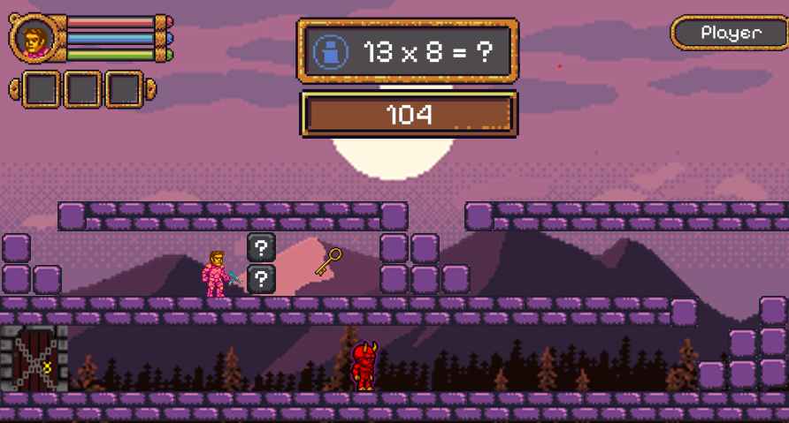
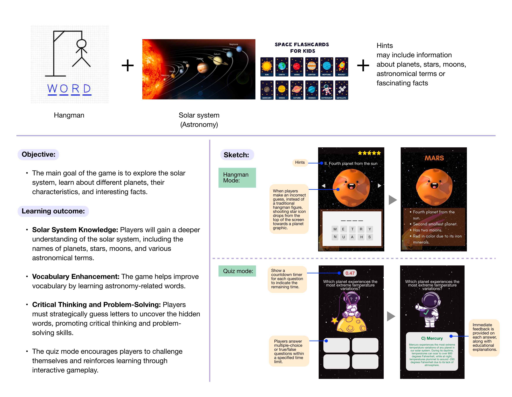
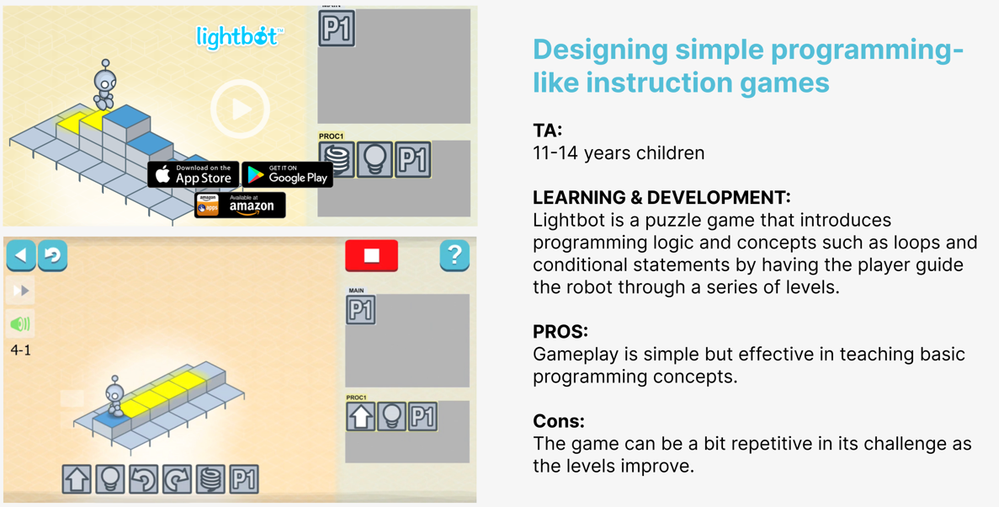
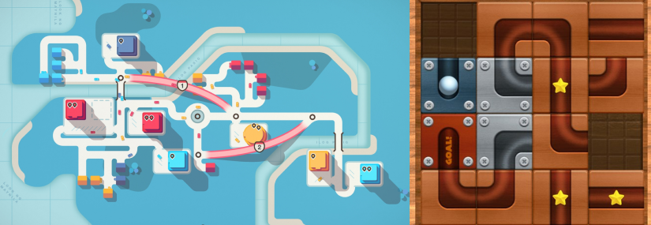
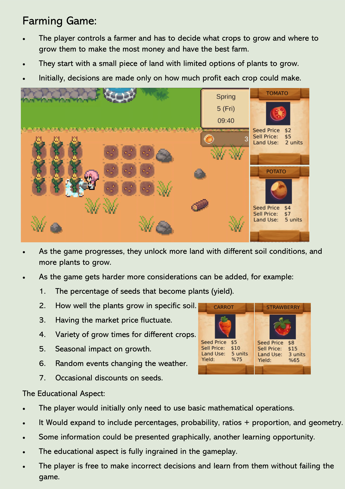
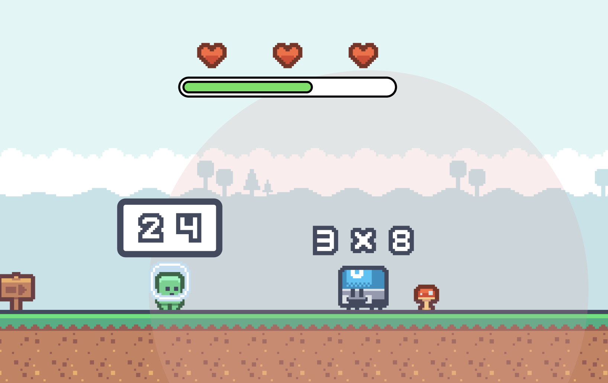

# Software Used:
### GitHub:
Some members already have experience in this, It also has a useful desktop app that will support beginners. Some members do not have access to the university of Nottingham GitLab server.

### Trello:
Originally we were using Jira to manage our project, but found it overly confusing. We have since moved to Trello and will use markdown files in GitHub for documentation.

# Game Idea:

Our main game will be a combination of Idea 1 and Idea 6. We can combine these two platformer games, taking the best elements of both. We will be extending the project by allowing questions form any topic to be in the levels. We will also try to use the suggestions from Idea 2 and Idea 4 as minigames or topics in the platformer.

## Idea 1

Hemal Panchal: Platformer problem solver

- Pros:
    -	Suitable topic for children
    -	Scope of project is perfect
    -	Learning outcome is integrated into game mechanics
    -   Can incorporate other members ideas inside
- Cons:
    -	Initially limited to only maths topics
    -	May be hard to design multiple levels
    -   Hard to change difficulty. 

 
## Idea 2

Patwitra Kultanarueangnon: Solar system learmig

- Pros:
    -	Suitable topic for children
    -	Great design to encourage learning
    -	Different difficulty levels
- Cons:
    -	Limited amount of questions
    -	Topic limited to astronomy 

## Idea 3

Wei-Che Lin: Teaching programming.

- Pros:
    -	Suitable topic for children
    -	New area that is important to learn
    -	Learning outcome is integrated into game mechanics
- Cons:
    -	Some group members not confident with 3D
    -	Topic limited to Logic 

## Idea 4

Jingwen Xu: Logic Games

- Pros:
    -	Proven fun gameplay 
    -	Learning outcome is integrated into game mechanics
- Cons:
    -	Scope may be to large for the project
    -	Topic is Limited to specific games

## Idea 5

Leo Meyler: Farming game

- Pros:
    -	Good integration of learning into gameplay mechanic
    -	Novel Idea
    -	Scalable difficulty

- Cons:
    -	No plan for 3D/2.5D/2D game
    -	Would it be point and click, or move player around
    -	Limited to maths concepts only

## Idea 6

Rohosen Bhattacharya: Mario-like problem solver 

- Pros:
    -	Suitable topic for children
    -	Proven fun gameplay 
    -	Learning outcome is integrated into game mechanics
    -   Can incorporate other members ideas inside
- Cons:
    -   Unsure of how player will interact with enemies
    -   May not be able to trust procedural generation to make fun levels    
    -   Hard to change difficulty. 
