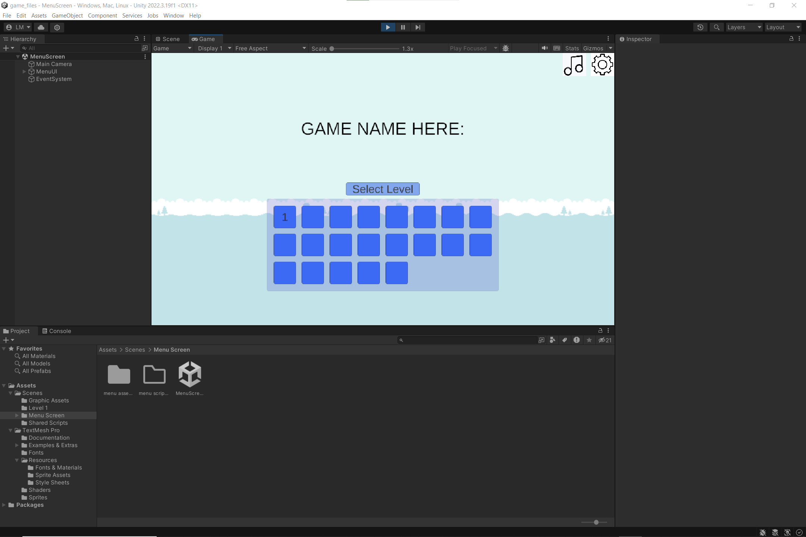

# Week 2 Overview

## Design and Implementation:

### Art design

Some sprites have been created for the game as well as a background and other useful art assets.

### Level Implementation

An initial level has been created, allowing testing of various scripts and gameplay mechanics, including testing art design.

### Main menu 

An initial main menu has been made, to test functionality, and to act as a placeholder until further art design can be implemented.

### Question creation

A set of questions ([here](week2-MathsQuestions.md)) have been created for initial testing, these are questions that will be awnsered by the player in the game. 

## Other

A Minimum Viable Product has been decided upon, team roles have been allocated, and documentation has been done. More information can be found on the readme page ([here](../../README.md)) under the "week 2" section.