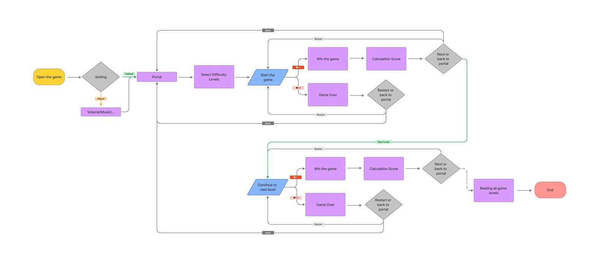
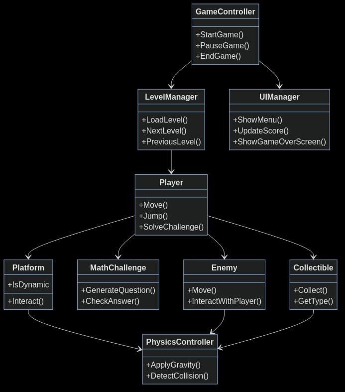
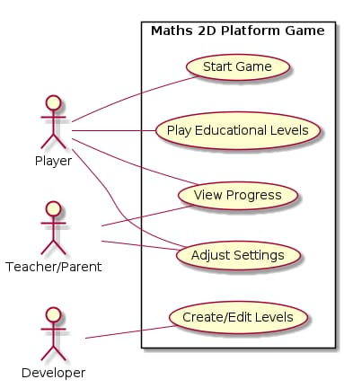

## Game Flow

> The final game flow with winning and losing logic.
> 

## Class diagram

> An overview of all the functions and how they work with each other.
> 

## Usecase Diagram

> How the users of the game interact and have different relationships and usecases with the game.
> 
