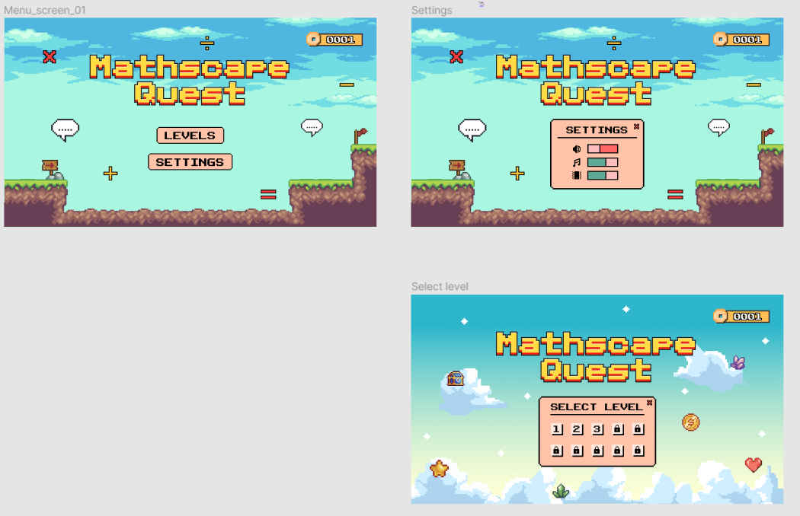
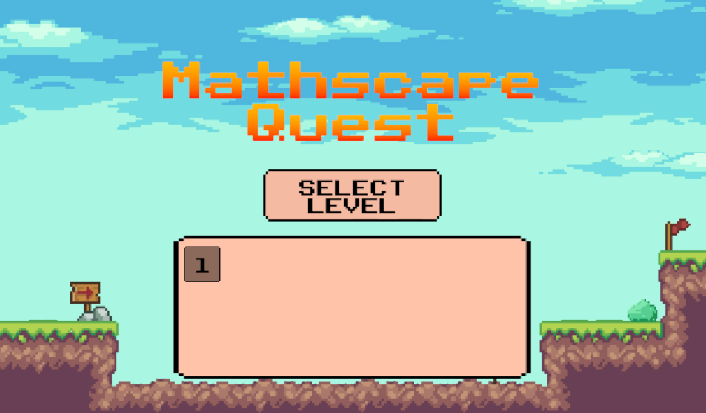
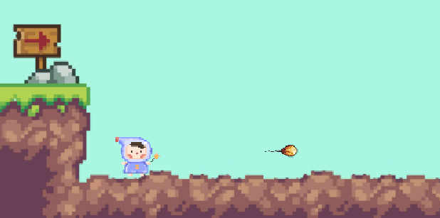
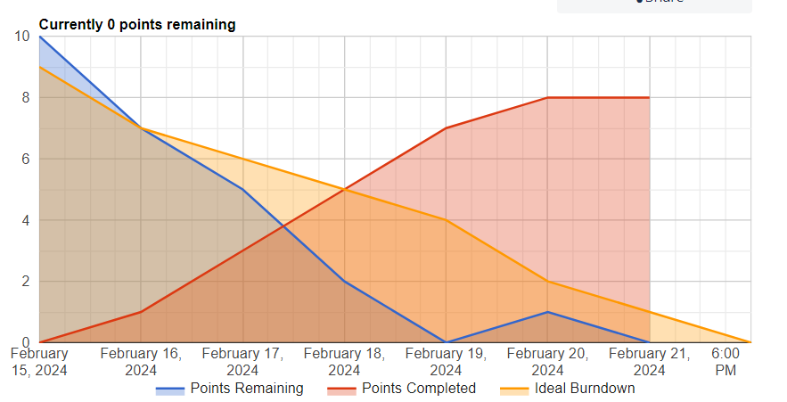

# Week 3 Overview

## Brief Overview of Work Compelted

The design team worked hard to make a new main menu design, and continue their work on level design.

Functionality for the main menu was made, old art was added to it before the new art was finished.

Functionality allowing the player to shoot has been made.

A burn down chart for this week has been made.

## Retrospective:

### What Went Well

- We added in more art to the first level, and added more functionality. The player shooting mechanic is now more polished, and the player script now passes its test, which check to make sure the player can not jump infinitely.
- We automated the level loading from the main menu.
- We have been able to more effectivley plan our weeks now that we now how long each issue will take others.
- New art designs have been made for the main menu, and more is being done for other levels.

### What Went Wrong

- Initially we expected to be able to reuse background assets for the main menu and levels. Unfortubatkey it is to sparse to work for the main menu, this meant that the design team had to do more work than we initially planned. It was completed, but there was not enough time to import them into the main menu.
- The Programming team were going to meet to dicuss the best way to import questions into the game dynamically, but due to peronal schedules and busy weeks this was not achived.
- We had wanted to discuss and create more gameplay mechanics, but as we were still in the process of polishing the game and working towards the MVP we decided to postpone this.
- The developer experience of the codebase is a little poor at the moment and could get worse with further additions.

### Sprint Backlog

- Group discussions on the above.
- Player Animation.
- begin unit testing.

### What Does This Mean For Next Week

- We will work to make sure that our main goals are more comprehensivley divided into seperate tickets.
- As a group we have decided to create 'scaffolding' so that those on the team with less programming experience can contribute to the level creation in unity - this will potentially be done by creating a tile map system.
- After reviewing the Burn Down chart we have noticed that documentation / admin / meetings takes longer than we anticipate, and so we will be allocating them more time.
- Focus on improving the code quality by organising it better and also reducing code redundancy.
