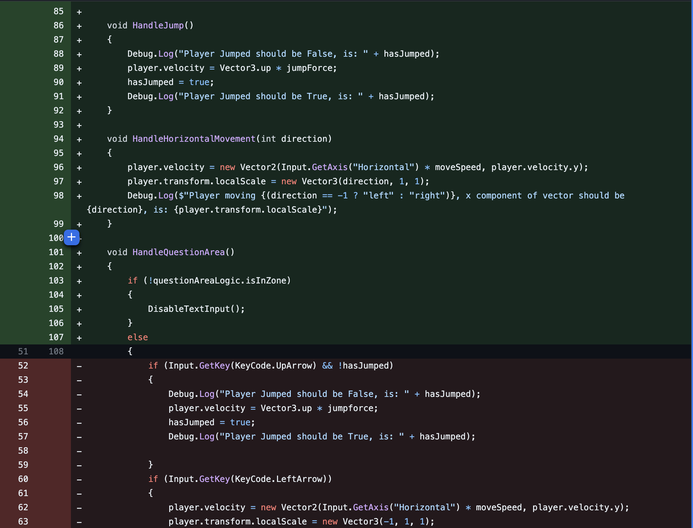
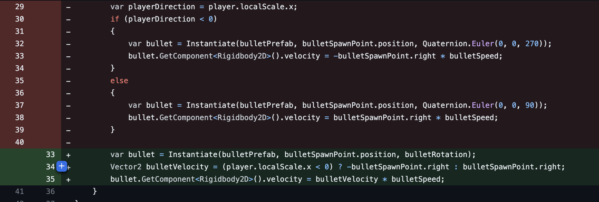
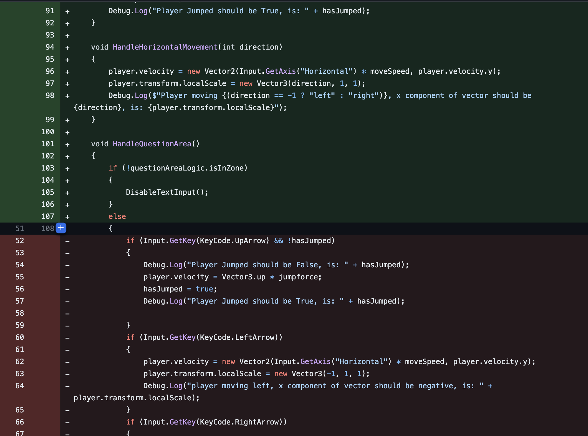

# Refactors

> https://github.com/Roho7/comp4024/pull/48/files#diff-974046d8949c2b68551467f3b899a7f8de4ad16d7d479c7ad2b26a7e2a975c42

## Player Logic

### Before

### After

### Before

### After

## Enemy Logic

## Submit Answers

## Player logic functions replaced

## Gun Logic refactor

## Enemy Logic refactor

